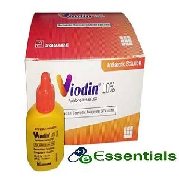
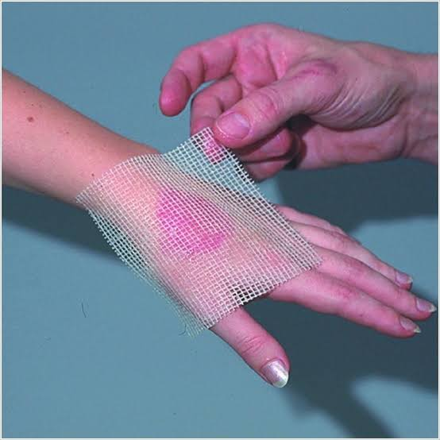
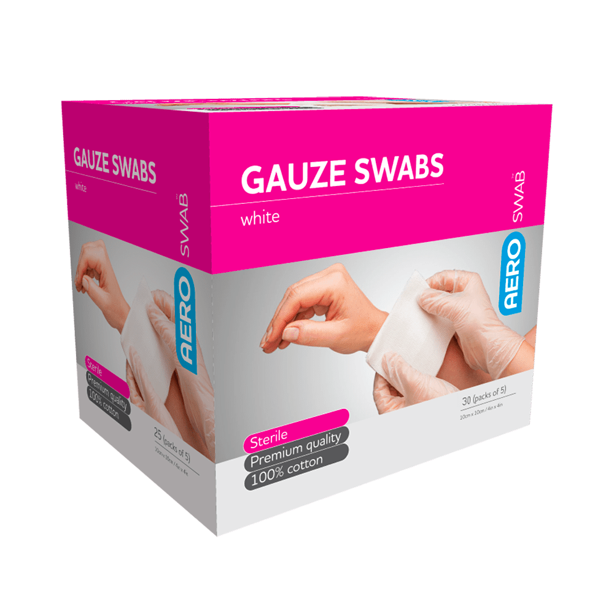

# Pratomik-cikidsa-100-

## রক্তে ২ টি উপাদান 
(১) কনিকা 
(২) প্লাজমা

## মেসিন নাম
(১) পালস অক্রসিমিটার/pulse oximeter---- রক্তে অক্সিজেন মাত্রা হার্ড পাল্স এর জন

[ Spo2= 95-10  Normal] ( রক্তের অক্সিজেন মাত্রা

[BPM=(60-100) Normal এর উপরে হলে বেশি ভালো ] ( হার্ট বিট কত বার লাফ দিচ্ছর)

(২) গ্লুকোমিটার---- ডাইবেডিস এর জন্য

(২) ফ্রাস্ট এইড box

# এনাটমিক

## Physiological System

শরীরে প্রধানত ১১টি Physiological System বা শারীরবৃত্তীয় তন্ত্র রয়েছে। এগুলো হলো:

1. Circulatory system (রক্ত সঞ্চালন তন্ত্র)

2. Respiratory system (শ্বসনতন্ত্র)

3. Digestive system (পরিপাকতন্ত্র)

4. Excretory system (বর্জ্য নিষ্কাশন বা রেচনতন্ত্র)

5. Nervous system (স্নায়ুতন্ত্র)

6. Muscular system (পেশীতন্ত্র)

7. Skeletal system (কঙ্কালতন্ত্র)

8. Endocrine system (অন্তঃক্ষর গ্রন্থি তন্ত্র বা হরমোন তন্ত্র)

9. Reproductive system (প্রজননতন্ত্র)

10. Integumentary system (ত্বক ও তৎসংলগ্ন তন্ত্র, যেমন চুল, নখ ইত্যাদি)

11. Lymphatic/Immune system (লসিকা ও রোগপ্রতিরোধী তন্ত্র)

##  ডেসিং করতে কি কি লাগে?

(১) কাটা স্থান ভায়োডিন দিয়ে পরিস্কার করতে হবে।

<!--[profile](./w.jpg)-->

(২) Sofra tulle 

<!--[profile](./w.jpg)-->

(3) গাউস অথবা গজ/ ডেসিং প্যাড লাগবে প্যাক দিয়ে হাত/পা/ কাটা স্থান বাদতে হবে।

<!--[profile](./w.jpg)-->

